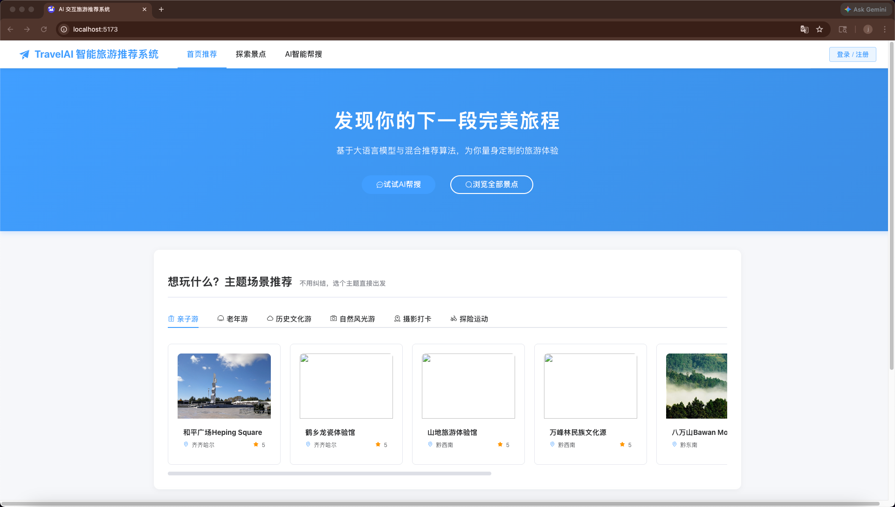
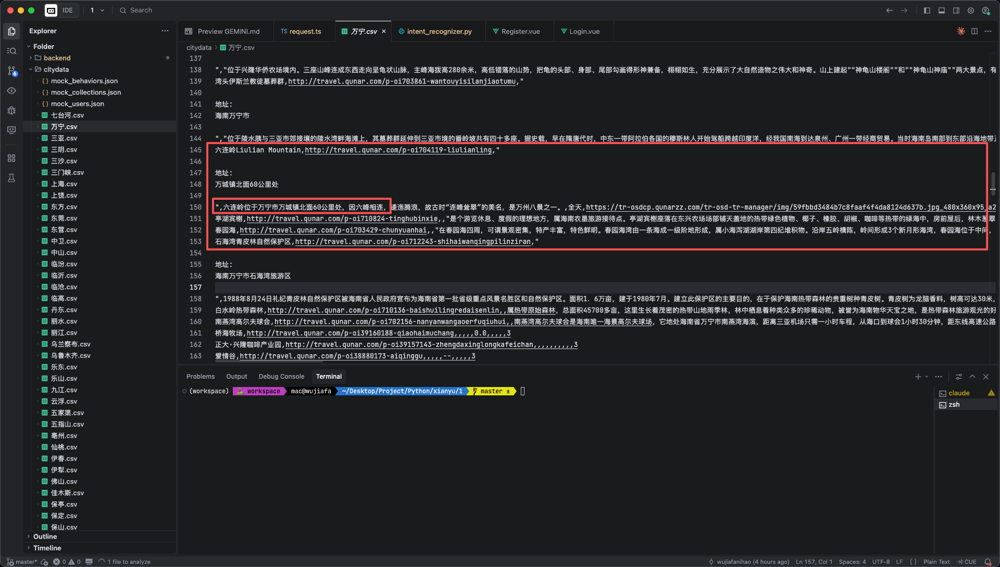
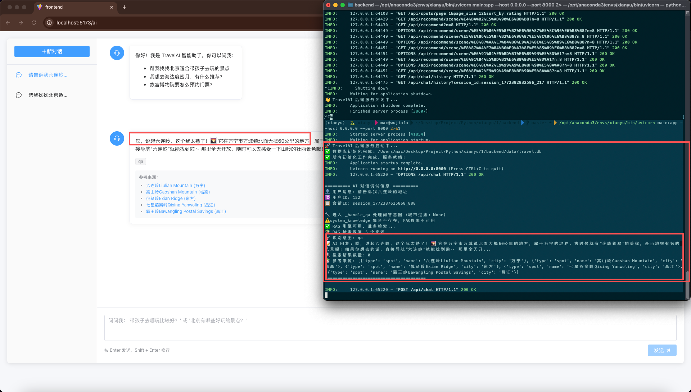

# 🗺️ TravelAI — 基于混合推荐的 AI 交互旅游推荐系统

> **毕业设计题目**: 基于混合推荐的 AI 交互旅游推荐系统的设计与实现
>
> **一句话介绍**: 这是一个用 Python + Vue 开发的智能旅游推荐网站。它能根据你的历史行为猜你喜欢什么景点（协同过滤），也能根据景点本身的特点推荐同类型的（内容推荐），还内置了一个 AI 聊天助手，你用自然语言说"我想带孩子去北京玩"，系统就能帮你搜出匹配的景点。

---

## 📑 目录

- [项目简介](#-项目简介)
- [系统功能清单](#-系统功能清单)
- [系统架构图](#-系统架构图)
- [核心流程图](#-核心流程图)
- [技术栈](#-技术栈)
- [数据资产](#-数据资产)
- [推荐算法原理](#-推荐算法原理)
- [AI 模块原理](#-ai-模块原理)
- [运行前准备](#-运行前准备)
- [部署与运行步骤](#-部署与运行步骤)
- [API 接口列表](#-api-接口列表)
- [项目目录结构详解](#-项目目录结构详解)
- [常见问题 FAQ](#-常见问题-faq)

---

## 📖 项目简介

TravelAI 是一个面向普通旅游用户的智能推荐系统。它整合了**三种推荐算法**（协同过滤、基于内容推荐、热门/场景推荐）和**大语言模型 AI 对话**，形成了一个"推荐 + 问答"双引擎的旅游服务平台。

### 系统解决的核心问题

1. **信息过载**：全国 33,174 个景点数据，用户不可能全看一遍。系统通过推荐算法，帮用户从海量数据中筛选出最可能感兴趣的景点。
2. **冷启动**：新注册用户没有行为数据怎么办？系统会根据用户填写的旅行偏好，用基于内容的推荐来"猜"用户喜好，随着用户使用越多，推荐越准。
3. **自然交互**：传统搜索只能输入关键词。TravelAI 内置 AI 聊天助手，用户可以用自然语言描述需求（比如"秋天带老人去南京赏枫叶"），系统自动理解意图并返回结果。

### 运行效果图

<div align="center">
  
  <p><em>图1：个性化推荐与场景化分类首页</em></p>

  
  <p><em>图2：多轮 AI 对话与智能意图识别</em></p>

  
  <p><em>图3：景点列表与多维条件筛选</em></p>

  
  <p><em>图4：景点详情页、真实用户评论与专属 AI 导游抽屉</em></p>
</div>

---

## ✅ 系统功能清单

| 功能模块 | 具体功能 | 实现状态 |
|---------|---------|:-------:|
| **用户认证** | 注册、登录（JWT Token）、查看/修改个人信息 | ✅ |
| **景点探索** | 景点列表（分页+按城市/类型/评分筛选）、景点搜索、景点详情 | ✅ |
| **收藏管理** | 收藏/取消收藏景点、查看收藏列表 | ✅ |
| **景点评论** | 用户可以对景点进行评分和文字评价 | ✅ |
| **行为记录** | 自动记录浏览、评分、收藏、搜索行为 | ✅ |
| **协同过滤推荐** | 基于用户相似度的"猜你喜欢" | ✅ |
| **内容推荐** | 基于景点特征的"相似景点推荐" | ✅ |
| **混合推荐融合** | 动态加权融合多种推荐结果 | ✅ |
| **场景化推荐** | 亲子游/老年游/历史文化/自然风光等 6 种场景 | ✅ |
| **热门推荐（兜底）** | 评分最高的景点作为冷启动兜底 | ✅ |
| **AI 智能对话** | 与大语言模型对话，支持多轮聊天和历史会话管理 | ✅ |
| **专属 AI 导游** | 景点详情页内置专属 AI 导游，提供沉浸式体验 | ✅ |
| **RAG 知识问答** | 基于向量检索的景点知识问答 | ✅ |
| **智能帮搜** | 自然语言→结构化条件→数据库查询 | ✅ |
| **意图识别** | 规则+LLM双层判断（搜索/问答/帮助/闲聊） | ✅ |
| **前端界面** | 首页推荐、景点列表、景点详情（含评论与AI导游）、AI对话、我的收藏、登录/注册 | ✅ |

---

## 🏗️ 系统架构图

本系统采用经典的 **四层架构**：交互层 → 功能层 → 算法层 → 数据层，层与层之间通过明确的接口通信。

```
┌─────────────────────────────────────────────────────────────────────┐
│                   🖥️ 交互层 (Vue 3 + Element Plus)                  │
│                                                                     │
│   ┌──────────┬──────────┬───────────┬──────────┬────────────┐       │
│   │ 首页推荐  │ 景点探索  │ 景点详情   │ AI 对话   │ 我的收藏    │       │
│   │ Home.vue │ SpotList │ SpotDetail│ Chat.vue │Collections │       │
│   └──────────┴──────────┴───────────┴──────────┴────────────┘       │
│                                                                     │
│   技术：Vue 3 + Vite + Element Plus + Pinia + Axios                 │
└───────────────────────────┬─────────────────────────────────────────┘
                            │ HTTP REST API (JSON)
                            │ 端口: 后端 8000 → 前端 5173
┌───────────────────────────┼─────────────────────────────────────────┐
│  ⚙️ 功能层 (FastAPI)       ▼                                        │
│                                                                     │
│   ┌──────────┬──────────┬───────────┬──────────┐                    │
│   │ 用户认证  │ 景点服务  │ 推荐服务   │ AI 对话   │                    │
│   │ auth.py  │ spots.py │recommend  │ chat.py  │                    │
│   │          │          │   .py     │          │                    │
│   └──────────┴──────────┴───────────┴──────────┘                    │
│                                                                     │
│   技术：FastAPI + JWT(python-jose) + bcrypt + Pydantic              │
└───────────────────────────┬─────────────────────────────────────────┘
                            │
┌───────────────────────────┼─────────────────────────────────────────┐
│  🧠 算法层                 ▼                                        │
│                                                                     │
│   ┌───────────────┬─────────────────┬─────────────────────┐        │
│   │ 协同过滤引擎    │ 内容推荐引擎      │ 混合融合策略          │        │
│   │ collaborative │ content_based   │ hybrid_recommender  │        │
│   │ _filter.py    │ .py             │ .py                 │        │
│   └───────────────┴─────────────────┴─────────────────────┘        │
│   ┌───────────────┬─────────────────┬─────────────────────┐        │
│   │ LLM 客户端     │ RAG 检索引擎     │ 意图识别器            │        │
│   │ llm_client.py │ rag_engine.py   │ intent_recognizer   │        │
│   │               │                 │ .py                 │        │
│   └───────────────┴─────────────────┴─────────────────────┘        │
│                                                                     │
│   技术：LangChain + OpenAI API + scikit-learn + numpy               │
└───────────────────────────┬─────────────────────────────────────────┘
                            │
┌───────────────────────────┼─────────────────────────────────────────┐
│  💾 数据层                 ▼                                        │
│                                                                     │
│   ┌────────────────┬──────────────────┬────────────────────┐       │
│   │  SQLite         │  ChromaDB        │  CSV 文件           │       │
│   │  travel.db      │  chroma_db/      │  citydata/          │       │
│   │  (7张表)        │  (向量知识库)     │  (352个城市CSV)     │       │
│   │  ~57MB          │  ~4GB            │  ~33174条景点       │       │
│   └────────────────┴──────────────────┴────────────────────┘       │
└──────────────────────────────────────────────────────────────────────┘
```

---

## 🔄 核心流程图

### 1. 用户推荐流程

```
用户访问首页
    │
    ▼
系统判断用户类型
    │
    ├── 新用户（行为 < 5 条）
    │       │
    │       ▼
    │   100% 内容推荐（根据注册时选的偏好）
    │   + 热门推荐兜底
    │
    ├── 成长期用户（5-20 条）
    │       │
    │       ▼
    │   内容推荐为主 + 逐渐加入协同过滤
    │   （协同过滤权重从 0 线性增长到 0.4）
    │
    └── 活跃用户（> 20 条）
            │
            ▼
        协同过滤 60% + 内容推荐 40%
        （"和你品味相似的人也喜欢这个"）
            │
            ▼
    融合打分 → 排序 → Top-N → 附带推荐理由 → 返回前端
```

### 2. AI 智能对话流程

```
用户发消息："我想带孩子去北京玩" 
    │
    ▼
意图识别器（规则 + LLM 双层判断）
    │
    ├── 搜索意图 → 智能帮搜
    │       │
    │       ├── LLM 提取条件 → {"city":"北京","target_group":"亲子"}
    │       ├── 构建 SQL 查询 → 从数据库搜索匹配景点
    │       └── LLM 生成推荐语 → 返回景点卡片 + 推荐文案
    │
    ├── 问答意图 → RAG 管线
    │       │
    │       ├── 用户问题 → 向量化（Qwen3-Embedding）
    │       ├── ChromaDB 检索 Top-5 相关文档
    │       ├── 拼装 Prompt（系统提示 + 参考资料 + 用户问题）
    │       └── DeepSeek-V3.2 生成回答
    │
    ├── 帮助意图 → FAQ 知识库
    │       └── 搜索 FAQ → 生成使用指南回答
    │
    └── 闲聊意图 → 直接对话
            └── DeepSeek 自由回答
```

---

## 🛠️ 技术栈

### 后端（Python）

| 技术 | 版本 | 作用 |
|------|------|------|
| Python | 3.10+ | 编程语言 |
| FastAPI | 0.115.0 | Web API 框架，自动生成 Swagger 文档 |
| Uvicorn | 0.30.6 | ASGI 服务器，运行 FastAPI |
| SQLite | 内置 | 关系型数据库（轻量，免安装） |
| ChromaDB | 0.6.3 | 向量数据库（存储文档的嵌入向量） |
| LangChain | 0.3.25 | LLM 应用开发框架 |
| langchain-openai | 0.3.18 | LangChain 的 OpenAI 兼容接口 |
| OpenAI SDK | 1.82.0 | 调用 ModelScope 的嵌入 API |
| scikit-learn | 1.6.1 | 机器学习工具（余弦相似度计算） |
| NumPy | 2.2.6 | 数值计算（矩阵运算） |
| Pandas | 2.2.3 | 数据处理（读 CSV） |
| python-jose | 3.3.0 | JWT Token 生成与验证 |
| bcrypt | 4.2.1 | 密码加密（bcrypt 哈希算法） |
| Pydantic | 2.11.3 | 数据模型校验 |
| python-dotenv | 1.0.1 | 读取 .env 环境变量 |

### 前端（JavaScript/TypeScript）

| 技术 | 版本 | 作用 |
|------|------|------|
| Vue 3 | 3.5.25 | 前端 UI 框架（响应式+组件化） |
| Vite | 8.0.0 | 前端构建工具（超快热重载） |
| Element Plus | 2.13.3 | Vue 3 UI 组件库（表单/表格/弹窗等） |
| Pinia | 3.0.4 | Vue 3 状态管理（存登录状态） |
| Vue Router | 5.0.3 | 前端路由（页面跳转） |
| Axios | 1.13.6 | HTTP 请求库（调后端 API） |
| marked | 17.0.3 | Markdown 渲染（AI 回复格式化） |
| TypeScript | 5.9.3 | 类型安全的 JavaScript |

### AI 模型（由 ModelScope 提供）

| 模型 | 用途 | 说明 |
|------|------|------|
| **DeepSeek-V3.2** | 对话/问答/意图识别/条件提取 | 大语言模型，负责"理解"和"生成"文本 |
| **Qwen3-Embedding-8B** | 向量嵌入 | 把文本变成 4096 维向量，用于相似性检索 |

---

## 📊 数据资产

### 1. 景点数据（真实数据）

数据来源为去哪儿网景点数据，存放在 `citydata/` 目录下。

| 指标 | 数值 |
|------|------|
| 城市 CSV 文件数 | **352 个（覆盖全国主要城市）** |
| 总景点记录数 | **33,174 条** |
| 数据来源 | 去哪儿网 (qunar.com) |
| 数据库大小 | ~57MB (SQLite) |

每个景点包含以下 12 个字段：

| 字段 | 说明 | 举例 |
|------|------|------|
| 名字 | 景点中英文名 | `故宫博物院The Palace Museum` |
| 链接 | 数据源URL | `http://travel.qunar.com/...` |
| 地址 | 地址+电话+官网 | `北京市东城区景山前街4号` |
| 介绍 | 景点详细描述（RAG核心） | 长文本 |
| 开放时间 | 营业时间 | `全年 07:30-16:00` |
| 图片链接 | 景点图片URL | 可用于前端展示 |
| 评分 | 用户评分 | `4.0`~`5.0`（协同过滤关键字段） |
| 建议游玩时间 | 游览时长建议 | `3小时 - 4小时` |
| 建议季节 | 最佳游览季节 | `春季`、`四季皆宜` |
| 门票 | 票价信息 | JSON格式 |
| 小贴士 | 注意事项（RAG内容） | 长文本 |
| Page | 爬虫页码 | 忽略 |

### 2. 模拟用户数据（脚本生成）

为了让推荐算法有数据可用，系统会自动生成模拟用户数据：

| 数据类型 | 数量 | 说明 |
|---------|------|------|
| 模拟用户 | **150 个** | 覆盖各年龄段（18-70岁）、活跃度 |
| 行为记录 | **~15,000 条** | 浏览(60%)/评分(20%)/收藏(10%)/搜索(10%) |
| 收藏记录 | **~1,600 条** | 约140人有收藏，人均11条 |
| 评分记录 | **~3,000 条** | 平均评分3.55（偏右偏高分布，更真实） |
| 用户评论 | **~230,000 条** | 每个景点3-10条评论，评分基于景点评分生成 |
| 冷启动用户 | **~30 个** | 行为<5条，专门测试冷启动场景 |

### 3. 向量知识库（ChromaDB）

| 指标 | 数值 |
|------|------|
| 景点文档数 | **~16,750 条**（有完整介绍的景点） |
| 系统FAQ | **15 条** |
| 嵌入维度 | **4096 维** |
| 嵌入模型 | Qwen3-Embedding-8B |

### 4. 数据库表结构（8 张表）

| 表名 | 用途 | 重要字段 |
|------|------|---------|
| `users` | 用户信息 | username, password_hash, age, gender, city, travel_style |
| `spots` | 景点信息 | name, city, rating, description, spot_type, target_group |
| `user_behaviors` | 用户行为记录 | user_id, spot_id, behavior_type, rating, duration |
| `user_collections` | 用户收藏 | user_id, spot_id (联合唯一) |
| `user_similarity` | 协同过滤相似度 | user_id_a, user_id_b, similarity |
| `spot_features` | 景点特征向量 | spot_id, feature_vector(28维), feature_labels |
| `chat_history` | AI对话历史 | user_id, role, content, session_id |
| `spot_comments` | 用户评论 | user_id, spot_id, rating, content |

---

## 🧮 推荐算法原理

### 1. 协同过滤（collaborative_filter.py）

**核心思想**："和你品味相似的人喜欢的东西，你大概率也喜欢。"

```
步骤：
1. 构建"用户-景点评分矩阵" → 每个用户对每个景点的评分
2. 用余弦相似度计算任意两个用户的相似程度
3. 找到 K=20 个最相似的用户（K近邻）
4. 用加权平均预测当前用户对未评分景点的评分
5. 按预测评分排序，推荐 Top-N
```

**公式**：

```
                    Σ (sim(u,v) × rating(v,i))
predicted(u,i) = ────────────────────────────────
                       Σ |sim(u,v)|
```

### 2. 基于内容推荐（content_based.py）

**核心思想**："你以前喜欢什么类型的景点，就给你推荐同类型的。"

```
步骤：
1. 把每个景点的属性提取成 28 维特征向量：
   - 景点类型 (8维): 自然风光/历史文化/宗教场所/主题乐园/博物馆/现代都市/园林公园/乡村田园
   - 季节适宜 (4维): 春/夏/秋/冬
   - 地理区域 (7维): 华北/华东/华南/华中/西南/西北/东北
   - 适合人群 (6维): 亲子/老年/情侣/学生/摄影/探险
   - 数值特征 (3维): 评分/游览时长/价格
2. 把用户喜欢过的景点特征向量取平均 → 得到"用户偏好向量"
3. 计算所有景点和用户偏好向量的余弦相似度
4. 按相似度排序，推荐 Top-N
```

### 3. 混合推荐融合（hybrid_recommender.py）

**核心思想**：动态加权混合，新用户靠内容，老用户靠协同过滤。

```
融合公式：
score(u, i) = w_CF × score_CF(u, i) + w_CB × score_CB(u, i)

权重策略：
- 新用户（行为 < 5条）:   w_CF=0.0,  w_CB=1.0   → 纯内容推荐
- 成长用户（5-20条）:     w_CF=0→0.4, w_CB=1→0.6 → 渐进混合
- 活跃用户（> 20条）:     w_CF=0.6,  w_CB=0.4   → 协同为主

兜底策略：
- 如果混合结果不够 N 条，用热门推荐（高评分景点）补齐
- 支持 6 种场景化推荐（亲子游/老年游/历史文化/自然风光/摄影打卡/探险运动）
```

---

## 🤖 AI 模块原理

### 1. RAG 检索增强生成（rag_engine.py）

```
用户问题 → Qwen3-Embedding-8B 向量化
    → ChromaDB 检索 Top-5 相关景点文档
    → 拼装 Prompt（系统提示 + 参考资料 + 问题）
    → DeepSeek-V3.2 生成回答
    → 返回答案 + 参考来源
```

RAG 的意义：让 AI 的回答"有据可查"，不是瞎编，而是基于真实景点数据的。

### 2. 意图识别（intent_recognizer.py）

采用**规则 + LLM 双层识别**策略：

- **第一层（规则匹配）**：检查关键词，80%以上的请求在这一层就能判断，速度快、不花 API 调用费。
  - 包含"推荐/好玩/想去" → 搜索意图
  - 包含"几点/门票/地址" → 问答意图
  - 包含"怎么注册/怎么收藏" → 系统帮助意图
  - 包含"你好/谢谢" → 闲聊意图

- **第二层（LLM 判断）**：规则判断不确定时，才调用 DeepSeek 来判断。

### 3. 智能帮搜（intent_recognizer.py → SmartSearcher）

```
"秋天带老人去南京看枫叶"
    → LLM 提取条件 → {"city":"南京", "season":"秋", "target_group":"老年", "keywords":["枫叶"]}
    → 构建 SQL 查询 → WHERE city='南京' AND suggest_season LIKE '%秋%' AND ...
    → 返回匹配景点列表
```

---

## 🔑 运行前准备

### 1. 环境要求

| 软件 | 版本要求 | 用途 |
|------|---------|------|
| Python | 3.10 及以上 | 后端运行 |
| Node.js | 18 及以上 | 前端构建 |
| Conda（推荐） | 任意 | Python 环境隔离 |
| Git | 任意 | 代码管理 |

### 2. 获取 ModelScope API Key（重要！）

本项目使用 **ModelScope（魔塔社区）** 提供的免费 AI 模型 API。你需要先获取一个 API Key。

**获取步骤：**

1. 打开 [魔塔社区官网](https://modelscope.cn/)
2. 点击右上角 **"登录/注册"**，用手机号或支付宝注册一个账号
3. 登录后，点击右上角头像 → **"API-Key管理"**
4. 或直接访问：https://modelscope.cn/my/myapikey
5. 点击 **"创建 API Key"**，复制生成的 Key（格式为 `ms-xxxx...`）
6. 把 Key 填入项目根目录的 `.env` 文件中的 `LLM_API_KEY` 字段

**本项目使用的两个模型：**

| 模型名 | 用途 | 备注 |
|--------|------|------|
| `deepseek-ai/DeepSeek-V3.2` | 大语言模型（聊天/问答/提取信息） | 免费调用 |
| `Qwen/Qwen3-Embedding-8B` | 嵌入模型（文本→向量） | 免费调用 |

> ⚠️ **注意**：ModelScope 的免费额度有一定限制，日常开发测试完全够用。如果遇到限速(429)，稍等一会儿再试即可。

### 3. 配置 .env 文件

项目根目录已经有一个 `.env` 模板文件。你需要做的只是**把 API Key 替换成你自己的**：

```env
# ============================================
# TravelAI 智能旅游推荐系统 - 环境变量配置
# ============================================

# --- AI 模型配置 ---
LLM_BASE_URL=https://api-inference.modelscope.cn/v1/
LLM_API_KEY=你的Key填这里               # ← 替换成你自己的 ModelScope API Key
LLM_MODEL_NAME=deepseek-ai/DeepSeek-V3.2
EMBEDDING_MODEL_NAME=Qwen/Qwen3-Embedding-8B

# --- 数据库配置（一般不用改） ---
DATABASE_PATH=data/travel.db
CHROMA_DB_PATH=data/chroma_db

# --- JWT 认证配置（一般不用改） ---
JWT_SECRET_KEY=travelai-secret-key-2026-xianyu-graduation
JWT_ALGORITHM=HS256
JWT_EXPIRE_MINUTES=1440

# --- 应用配置 ---
APP_HOST=0.0.0.0
APP_PORT=8000
APP_DEBUG=true
```

---

## 🚀 部署与运行步骤

### 第一步：创建 Conda 环境并安装后端依赖

```bash
# 1. 创建名为 xianyu 的 Conda 环境
conda create -n xianyu python=3.10 -y

# 2. 激活环境
conda activate xianyu

# 3. 进入项目根目录，安装 Python 依赖
cd /你的路径/xianyu/1
pip install -r requirements.txt
```

### 第二步：初始化数据库和导入数据

```bash
# 进入后端目录
cd backend

# 1. 初始化数据库（创建7张表）
python database.py

# 2. 导入景点数据（把 citydata 目录下 352 个 CSV 导入 SQLite）
python scripts/import_citydata.py
# 输出: ✅ 成功导入 33174 条景点数据

# 3. 生成模拟用户数据（150个用户+15000条行为+1600收藏）
python scripts/generate_mock_users.py
# 输出: ✅ 数据生成完成

# 4. 生成用户评论数据（~230,000条评论）
python scripts/generate_mock_comments.py
# 输出: ✅ 成功生成 X 条评论，数据库共有 X 条评论
```

### 第三步：计算推荐模型

```bash
# 还是在 backend 目录下

# 1. 计算协同过滤相似度矩阵
python algorithms/collaborative_filter.py
# 输出: ✅ 共计算 11026 对，124 对有效相似度

# 2. 计算内容推荐特征向量
python algorithms/content_based.py
# 输出: ✅ 计算了 33174 个景点的特征向量 (28维)
```

### 第四步：构建向量知识库（可选，AI对话功能需要）

> ⚠️ 此步骤需要有效的 ModelScope API Key，且耗时较长（约30-60分钟，取决于网络速度），因为要把 16,750 条景点数据通过 API 转换成向量。

```bash
# 构建 ChromaDB 向量知识库
python scripts/build_vectors.py
# 会显示进度条，耐心等待
```

> 💡 **如果跳过这一步**：推荐功能正常可用，但 AI 对话中的"景点知识问答"功能会降级为直接使用大模型回答（不带参考资料）。

### 第五步：启动后端服务

```bash
# 在 backend 目录下，启动 FastAPI 后端
uvicorn main:app --host 0.0.0.0 --port 8000

# 如果想要热重载（开发模式），加 --reload:
# uvicorn main:app --host 0.0.0.0 --port 8000 --reload
```

启动成功后你会看到：

```
🚀 TravelAI 后端服务启动中...
✅ 数据库初始化完成
✅ 所有初始化工作完成，服务就绪！
INFO:     Uvicorn running on http://0.0.0.0:8000
```

用浏览器打开 http://localhost:8000/docs 可以看到 Swagger API 文档。

### 第六步：启动前端

```bash
# 新开一个终端窗口，进入前端目录
cd frontend

# 1. 安装前端依赖
npm install

# 2. 启动开发服务器
npm run dev
```

启动后用浏览器访问 http://localhost:5173 即可体验系统。

### 快速验证清单

| 检查项 | 方法 | 预期结果 |
|--------|------|---------|
| 后端是否运行 | 浏览器打开 `http://localhost:8000/` | 看到 JSON 欢迎信息 |
| API 文档 | 浏览器打开 `http://localhost:8000/docs` | 看到 Swagger 文档 |
| 前端是否运行 | 浏览器打开 `http://localhost:5173` | 看到首页界面 |
| 注册功能 | 在前端注册一个新用户 | 注册成功并自动登录 |
| 景点列表 | 点击"景点探索" | 看到景点列表可分页筛选 |
| AI 对话 | 进入 AI 对话页，输入"你好" | 收到 AI 回复 |

---

## 📡 API 接口列表

所有接口前缀为 `/api`，完整文档可在 `http://localhost:8000/docs` 查看。

### 用户认证 `/api/auth`

| 方法 | 路径 | 说明 | 认证 |
|------|------|------|:----:|
| POST | `/auth/register` | 注册新用户 | ❌ |
| POST | `/auth/login` | 登录获取Token | ❌ |
| GET | `/auth/me` | 获取当前用户信息 | ✅ |
| PUT | `/auth/me` | 修改个人信息 | ✅ |

### 景点服务 `/api/spots`

| 方法 | 路径 | 说明 | 认证 |
|------|------|------|:----:|
| GET | `/spots` | 景点列表（分页+筛选） | ❌ |
| GET | `/spots/cities` | 获取所有城市列表 | ❌ |
| GET | `/spots/search?q=关键词` | 搜索景点 | ❌ |
| GET | `/spots/{id}` | 获取景点详情 | ❌ |

### 推荐服务 `/api/recommend`

| 方法 | 路径 | 说明 | 认证 |
|------|------|------|:----:|
| GET | `/recommend` | 获取个性化推荐 | ✅ |
| GET | `/recommend/scene/{scene}` | 场景化推荐 | ❌ |
| POST | `/recommend/behavior` | 记录用户行为 | ✅ |
| GET | `/recommend/collections` | 获取用户收藏列表 | ✅ |
| POST | `/recommend/collect/{id}` | 收藏/取消收藏 | ✅ |

### AI 对话 `/api/chat`

| 方法 | 路径 | 说明 | 认证 |
|------|------|------|:----:|
| POST | `/chat` | 发送消息给AI助手 | ✅ |
| GET | `/chat/history` | 获取对话历史 | ✅ |

---

## 📁 项目目录结构详解

```
xianyu/1/
│
├── .env                     # 🔐 环境变量配置文件（API Key、数据库路径等）
├── .gitignore               # Git 忽略规则（node_modules、数据库等不上传）
├── GEMINI.md                # 项目上下文文档（AI助手自动维护）
├── README.md                # 📖 项目说明文档（你正在看的这个）
├── requirements.txt         # 📦 Python 依赖清单
├── task.json                # 📋 任务追踪文件
│
├── citydata/                # 🗂️ 原始景点数据目录
│   ├── 北京.csv             # 每个文件是一个城市的景点数据
│   ├── 上海.csv
│   ├── 杭州.csv
│   └── ... (共352个CSV文件，33,174条景点)
│
├── backend/                 # ⚙️ Python FastAPI 后端
│   │
│   ├── main.py              # 🚪 后端入口文件
│   │                        #    创建 FastAPI 实例，注册所有路由，
│   │                        #    配置 CORS 跨域，启动时初始化数据库
│   │
│   ├── config.py            # ⚙️ 配置管理模块
│   │                        #    用 pydantic-settings 读取 .env 文件，
│   │                        #    提供全局配置单例（API地址、密钥、数据库路径等）
│   │
│   ├── database.py          # 💾 数据库初始化模块
│   │                        #    定义 7 张表的建表 SQL + 8 个索引，
│   │                        #    提供同步/异步两种初始化方式，
│   │                        #    以及 FastAPI 依赖注入的 get_db() 函数
│   │
│   ├── models/              # 📐 Pydantic 数据模型
│   │   ├── __init__.py
│   │   └── user.py          #    定义请求/响应的数据格式：
│   │                        #    UserRegister, UserLogin, TokenResponse,
│   │                        #    ChatMessage, ChatResponse, BehaviorRecord 等
│   │
│   ├── routers/             # 🛤️ API 路由模块
│   │   ├── __init__.py
│   │   ├── auth.py          # 🔐 用户认证路由
│   │   │                    #    注册(bcrypt加密) → 登录(验密码+签JWT)
│   │   │                    #    → 获取/修改个人信息(验JWT)
│   │   │
│   │   ├── spots.py         # 🏔️ 景点路由
│   │   │                    #    景点列表接口：支持分页(page/page_size)、
│   │   │                    #    城市过滤、类型过滤、最低评分过滤、排序
│   │   │                    #    景点搜索：在名称和介绍中模糊搜索
│   │   │                    #    景点详情：返回完整信息
│   │   │                    #    城市列表：返回所有349个城市名
│   │   │
│   │   ├── recommend.py     # ⭐ 推荐路由
│   │   │                    #    个性化推荐：调用混合推荐引擎
│   │   │                    #    场景化推荐：亲子游/老年游等6种场景
│   │   │                    #    行为记录：记录浏览/评分/收藏/搜索
│   │   │                    #    收藏管理：收藏/取消收藏（开关式）
│   │   │
│   │   └── chat.py          # 💬 AI对话路由
│   │                        #    接收用户消息 → 保存到对话历史
│   │                        #    → 调用意图识别 → 分发处理
│   │                        #    → 保存AI回复 → 返回结果
│   │
│   ├── algorithms/          # 🧮 推荐算法模块
│   │   ├── __init__.py
│   │   ├── collaborative_filter.py
│   │   │                    # 🤝 协同过滤推荐引擎
│   │   │                    #    加载评分数据 → 构建用户-景点评分矩阵
│   │   │                    #    → 余弦相似度计算 → K=20近邻选择
│   │   │                    #    → 加权预测评分 → 生成推荐
│   │   │                    #    结果保存到 user_similarity 表
│   │   │
│   │   ├── content_based.py
│   │   │                    # 📊 基于内容的推荐引擎
│   │   │                    #    景点属性 → 28维特征向量
│   │   │                    #    (类型8维+季节4维+区域7维+人群6维+数值3维)
│   │   │                    #    用户偏好向量 = 历史喜欢景点特征均值
│   │   │                    #    余弦相似度匹配 → 推荐
│   │   │                    #    结果保存到 spot_features 表
│   │   │
│   │   └── hybrid_recommender.py
│   │                        # 🔀 混合推荐融合引擎（对外统一接口）
│   │                        #    动态权重计算 → 融合CF和CB结果
│   │                        #    → 场景推荐支持 → 热门兜底
│   │                        #    → 附带推荐理由 → 补充景点详情
│   │
│   ├── ai/                  # 🤖 AI 智能模块
│   │   ├── __init__.py
│   │   ├── llm_client.py    # 🧠 LLM 客户端
│   │   │                    #    封装 ModelScope DeepSeek-V3.2 的调用
│   │   │                    #    三种方法：普通对话 / 带上下文对话(RAG核心)
│   │   │                    #    / 结构化JSON提取
│   │   │
│   │   ├── rag_engine.py    # 📚 RAG 检索增强生成引擎
│   │   │                    #    问题向量化 → ChromaDB检索Top5
│   │   │                    #    → Prompt组装 → LLM生成
│   │   │                    #    支持景点知识库 + FAQ知识库双库检索
│   │   │
│   │   └── intent_recognizer.py
│   │                        # 🎯 意图识别 + 智能帮搜 + 聊天服务
│   │                        #    IntentRecognizer: 规则+LLM双层意图识别
│   │                        #    SmartSearcher: 自然语言 → SQL查询
│   │                        #    ChatService: 统一消息处理入口
│   │
│   ├── scripts/             # 🔧 初始化脚本
│   │   ├── import_citydata.py
│   │   │                    # 📥 景点数据导入脚本
│   │   │                    #    遍历352个CSV → 清洗数据(地址/评分/时长)
│   │   │                    #    → 自动识别景点类型(8种)和适合人群(6种)
│   │   │                    #    → 批量插入SQLite (共33,174条)
│   │   │
│   │   ├── generate_mock_users.py
│   │   │                    # 👥 模拟用户数据生成脚本
│   │   │                    #    生成150个用户+15000行为+1600收藏
│   │   │                    #    行为70%匹配偏好/30%随机
│   │   │                    #    含冷启动测试用户
│   │   │
│   │   ├── generate_mock_comments.py
│   │   │                    # 💬 用户评论生成脚本
│   │   │                    #    为每个景点生成 3-10 条虚拟评论
│   │   │                    #    带有关联词和情绪的真实文本，供前端展示
│   │   │
│   │   └── build_vectors.py
│   │                        # 🧬 向量知识库构建脚本
│   │                        #    读取景点数据 → 拼接文本文档
│   │                        #    → Qwen3-Embedding-8B 向量化
│   │                        #    → 存入 ChromaDB (spot_knowledge集合)
│   │                        #    含FAQ知识 (system_knowledge集合)
│   │
│   ├── data/                # 💿 数据存储目录
│   │   ├── travel.db        #    SQLite 数据库文件 (~57MB)
│   │   └── chroma_db/       #    ChromaDB 向量数据库目录
│   │
│   ├── services/            # 📦 业务服务层（预留扩展）
│   │   └── __init__.py
│   │
│   └── tests/               # 🧪 测试目录（预留扩展）
│       └── __init__.py
│
└── frontend/                # 🖥️ Vue 3 + Vite 前端
    │
    ├── package.json         # 📦 前端依赖配置
    ├── vite.config.ts       # ⚡ Vite 构建配置
    ├── tsconfig.json        # TypeScript 配置
    ├── index.html           # HTML 入口
    │
    └── src/                 # 📂 前端源代码
        ├── main.ts          # 🚪 Vue 应用入口
        │                    #    创建 Vue 实例，注册 Element Plus、
        │                    #    Pinia、Router，挂载到 #app
        │
        ├── App.vue          # 🏠 根组件
        │                    #    包含 <router-view> 路由出口
        │
        ├── style.css        # 🎨 全局样式
        │
        ├── router/
        │   └── index.ts     # 🛤️ 前端路由配置
        │                    #    / → Home (首页推荐)
        │                    #    /login → Login (登录)
        │                    #    /register → Register (注册)
        │                    #    /spots → SpotList (景点列表)
        │                    #    /spot/:id → SpotDetail (景点详情)
        │                    #    /ai → Chat (AI对话)
        │
        ├── store/
        │   └── user.ts      # 📦 Pinia 用户状态管理
        │                    #    保存 token、用户信息
        │                    #    提供 login/logout/register 方法
        │
        ├── api/             # 📡 API 请求模块
        │   ├── index.ts     #    用户认证 API 封装
        │   ├── request.ts   #    Axios 请求实例（自动附带 Token）
        │   ├── spots.ts     #    景点 API 封装
        │   └── chat.ts      #    AI 对话 API 封装
        │
        ├── views/           # 📄 页面视图组件
            ├── Home.vue     # 🏠 首页 - 场景推荐入口 + 个性化推荐
            ├── Login.vue    # 🔐 登录页
            ├── Register.vue # 📝 注册页（含旅行偏好选择）
            ├── Collections.vue # ⭐️ 用户收藏页
            ├── Spot/
            │   ├── SpotList.vue    # 📋 景点列表页
            │   │                   #    城市筛选+类型筛选+评分筛选+分页
            │   └── SpotDetail.vue  # 📖 景点详情页
            │                       #    展示完整信息，支持收藏、评分、评论、AI导游
            └── AI/
                └── Chat.vue # 💬 AI 智能对话页
                             #    消息气泡+意图标签+景点卡片+引用来源
                             #    支持多轮对话+Markdown渲染+历史会话管理
```

---

## ❓ 常见问题 FAQ

### Q：模拟用户的密码是什么？

**A**：所有模拟用户（user_001 ~ user_150）的密码都是 **password123**。可以用这些账号登录测试推荐功能。

### Q：向量构建太慢怎么办？

**A**：`build_vectors.py` 需要调用 ModelScope API 处理约 16,750 条数据，每批 64 条，总共约 262 批。速度取决于网络和 API 速率限制。一般需要 30-60 分钟。如果不需要 AI 对话中的"基于知识库的问答"功能，可以跳过这一步，推荐功能不受影响。

### Q：API Key 报 429 错误怎么办？

**A**：429 是限速错误，说明短时间内请求太多了。稍等 30 秒重试即可。脚本内置了自动重试机制。

### Q：前端报 CORS 跨域错误怎么办？

**A**：后端已配置 `allow_origins=["*"]`，允许所有来源。如果仍有问题，检查后端是否正常运行（访问 `http://localhost:8000/` 确认）。

### Q：SQLite 数据库文件在哪？

**A**：在 `backend/data/travel.db`，约 57MB。如果想重新初始化，删除此文件后重新按"第二步"操作即可。

### Q：如何添加自己的景点数据？

**A**：在 `citydata/` 目录下新增 CSV 文件（格式参考已有文件），然后重新运行 `python scripts/import_citydata.py` 即可。

### Q：可以不用 Conda 吗？

**A**：可以。Conda 只是用于隔离 Python 环境。你也可以使用 `venv`：

```bash
python -m venv .venv
source .venv/bin/activate  # macOS/Linux
# .venv\Scripts\activate   # Windows
pip install -r requirements.txt
```

### Q：生产部署怎么做？

**A**：

```bash
# 后端
uvicorn main:app --host 0.0.0.0 --port 8000 --workers 4

# 前端打包
cd frontend && npm run build
# 然后用 Nginx 托管 dist/ 目录
```

---

## 📄 许可证

本项目为毕业设计作品，仅用于学术交流与学习目的。
